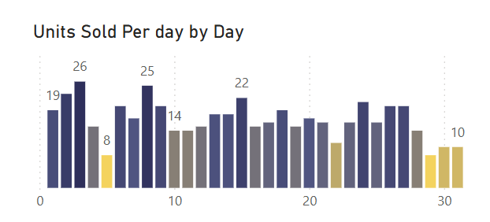

# Online Sales Dashboard (Excel & Power BI)

This project presents a dynamic sales dashboard built using Microsoft Excel and Power BI. It showcases sales performance across product categories, payment methods, and regions using a structured star schema (fact and dimension tables).

## 🔧 Tools & Technologies
- Microsoft Excel (data cleaning and dashboard creation)
- Power BI (interactive visual dashboards)
- Power Query
- DAX

## 🗃️ Data Model

The dataset is organized using a fact table and several dimension tables.

### 📌 Fact Table Columns:
- `Transaction ID`
- `Date_ID`
- `Product_id`
- `ProName_id`
- `Region_id`
- `Payment_ID`
- `Units Sold`
- `Unit Price`
- `Total Revenue`

### 📌 Dimension Tables:
- Date
- Product
- Product Name
- Region
- Payment Method

## ✅ Key Features
- Clean and interactive Power BI visuals
- Excel dashboard for quick insights
- Star schema modeling with relationships
- Business-focused metrics: revenue, units sold, payment types, and regional performance

## 📌 Key Insights
1. Analyze sales trends over time to identify seasonal patterns or growth opportunities.
2. Explore the popularity of different product categories across regions.
3. Investigate the impact of payment methods on sales volume or revenue.
4. Identify top-selling products within each category to optimize inventory and marketing strategies.
5. Evaluate the performance of specific products or categories in different regions to tailor marketing campaigns accordingly.

## 🖼️ Dashboard Preview

## 📁 Folder Structure

- `dashboard/` – Contains Power BI and Excel dashboards
- `data/` – Raw and cleaned datasets used for analysis
- `images/` – Screenshots of the dashboard (used in README)
- `README.md` – Project overview and documentation

